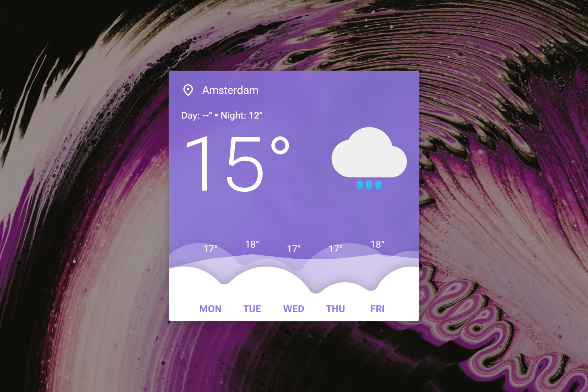

# Weatherbox (JD Edition)

  
 

This is a remake of [khanhas](https://forum.rainmeter.net/viewtopic.php?t=24597)' Weatherbox skin, which has unfortunately been broken for several years and neglected by the original artist. Now, there's a new one, with a _very_ nice loading animation ;)

As always, right-click the skin and hit "Settings..." to change the settings.

NOTICE: Windows 11 is _HIGHLY_ recommended for this skin.

----

## Installation

1. Download and install the latest version of [Rainmeter](https://www.rainmeter.net/).  
2. Download the [skin](https://github.com/adriaanjelle/Weatherbox-JD-Edition/releases/latest) and open the .rmskin file (it should have a green raindrop icon).  
3. Done!
